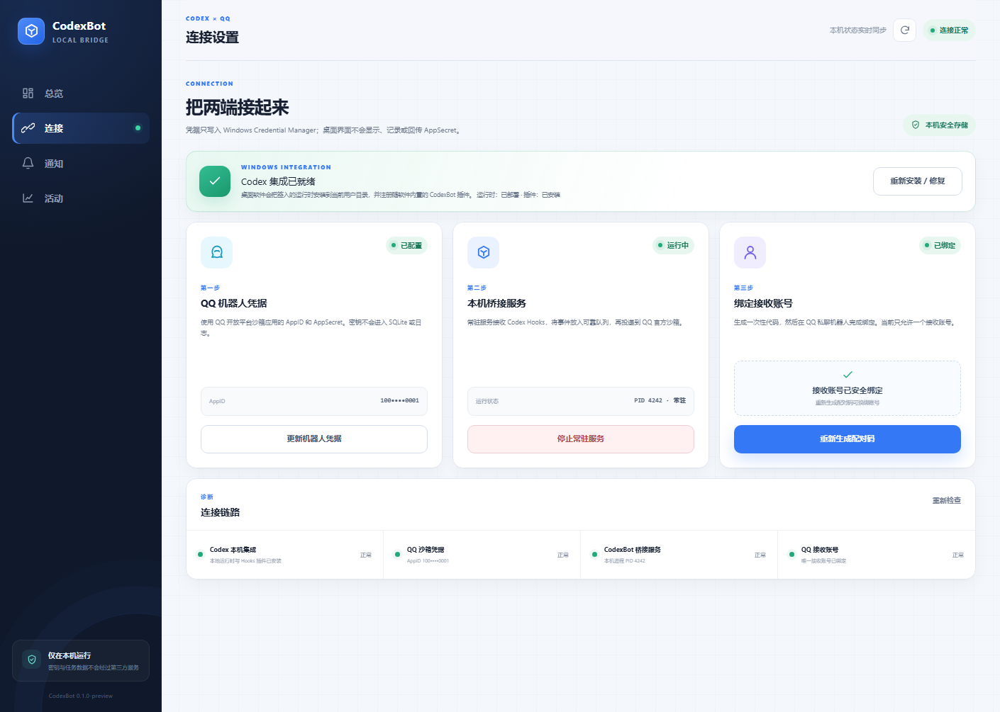

<p align="center">
  
</p>

<h1 align="center">CodexBot</h1>

<p align="center">
  把 Codex 的关键状态带到你的手机上<br>
  Bring the important moments of Codex to your phone
</p>

<p align="center">
  <a href="#中文">简体中文</a> · <a href="#english">English</a>
</p>

<p align="center">
  <a href="https://www.rust-lang.org/"></a>
  <a href="https://www.microsoft.com/windows"></a>
  <a href="LICENSE"></a>
</p>

## 中文

### 它解决了什么问题？

过去，使用 Codex 写程序意味着你要像监工一样频繁刷新屏幕，紧盯它的每一步操作。

CodexBot 彻底改变了这种体验：它化身为你的“远程助手”，在后台全程托管 Codex 的编程任务，只把那些必须由你拍板的必要事项，精准推送到 QQ 通知你。从此，你不再需要盯屏等待；只要在手机上收到消息时查看提醒，在需要决定时回到 Codex 完成确认，编程过程就能继续推进。

CodexBot 是一个运行在 Windows 本机的 Codex 生命周期通知桥接器。它读取 Codex Hooks，将任务开始、任务完成和可选的权限提醒放入本地队列，再通过 QQ 官方 Bot 沙箱发送给已绑定的 QQ 用户。

> QQ 端以通知为主，只额外开放文档列出的账号切换命令；不能直接批准、拒绝、提交提示词或执行任意命令。真正需要确认的操作仍然在 Codex 中完成。

### 核心能力

- 任务开始通知：项目、模型、时间和脱敏后的提示词摘要。
- 任务完成通知：完整的 `last_assistant_message`，超过 QQ 限制时自动分段。
- 子智能体静默：只通知主任务的一次总开始和总结果，不推送子智能体的启动、提示词或结束结果。
- 权限提醒：默认关闭，显式开启后才通知人工确认请求；自动审查不会默认制造“等待人工审批”的噪音。
- 多窗口支持：多个 Codex 窗口和多个项目共享一个 daemon 与消息队列，会话按 `session_id + 工作目录` 隔离。
- 可靠投递：SQLite WAL、本地 outbox、速率限制、重试、分段和永久错误处理。
- Codex 账号与用量：通过本机 app-server 读取账号/套餐和所有限额 bucket；兼容 Codex Switcher（`codex_login`）保存的多账号，并显示限额剩余百分比、窗口和重置时间。
- 隐私保护：AppSecret 存放在 Windows Credential Manager；提示词预览、错误和日志中的常见密钥会脱敏。
- 账号安全：CodexBot 不会把 `codex_login` 中的 token 复制到数据库、日志或 QQ。切换时会先关闭正在运行的 Codex/ChatGPT，原子替换 `CODEX_HOME\auth.json`、同步 `accounts.json` 的当前账号，再自动重新打开 Codex；同步失败会恢复原登录，并尽力重新打开原会话。CodexBot 自有快照继续使用 Windows DPAPI 加密存放在 `%LOCALAPPDATA%\CodexBot\accounts`。
- 受限控制：不调用 OpenAI API，不创建第二个 Codex/ChatGPT 会话；QQ 只能触发文档列出的账号切换与通知命令，不能执行任意命令或代替本机审批。

### 环境要求

- Windows 10 或 Windows 11（x64）；Rust 依赖版本由 `Cargo.lock` 锁定。
- Rust 1.85 或更高版本（通过 [rustup](https://rustup.rs/) 安装稳定版即可）；安装器会调用 `cargo build --release --locked`。
- 已安装并能正常运行的 Codex Desktop 或 Codex CLI，且支持 Codex Plugins / Lifecycle Hooks。
- `/usage` 和 `/account` 已在 Codex CLI 0.146.0 验证；缺少 app-server auth endpoint 的旧版会显示降级提示。
- 一个 QQ 官方机器人沙箱应用，并取得 AppID、AppSecret；需要在 QQ 开放平台启用私聊事件和主动消息能力。
- 你的 QQ 账号已经加入该机器人沙箱。
- 安装依赖和运行通知时需要网络；不需要 OpenAI API Key。

### 安装

在 PowerShell 或命令提示符中执行：

```bat
git clone https://github.com/LeaningLearner/codexbot.git
cd codexbot
.\install.cmd
```

安装器会完成以下工作：

1. 使用锁定依赖构建原生 Rust 发布版。
2. 将单一 `codexbot.exe` 安装到 `%LOCALAPPDATA%\CodexBot\bin`。
3. 将 QQ 凭据写入 Windows Credential Manager。
4. 安装个人 Codex 插件并注册生命周期 Hooks。
5. 生成一次性 QQ 配对码。

安装完成后，重启 Codex，在 Codex 的 `/hooks` 页面检查并信任 `codexbot` Hooks。然后在 QQ 中向机器人发送安装器显示的命令：

```text
/bind XXXX-XXXX
```

配对码默认 30 分钟有效。需要重新生成时执行：

```bat
.\codexbot.cmd pair
```

#### Windows 图形桌面版

`ui/` 提供与原生运行时共用数据和凭据的 Tauri 2 桌面控制台，可配置 QQ 凭据、安装或修复 Codex 插件、启停桥接服务、生成配对码并查看连接状态。从源码构建安装版和便携版：

```bat
.\build-windows.cmd
```

构建产物写入本地 `dist\` 目录；该目录不会提交到 GitHub。桌面程序不会把 AppSecret 返回给前端，凭据仍只保存在 Windows Credential Manager。

### 检查安装状态

```bat
.\codexbot.cmd doctor --offline
.\codexbot.cmd doctor
```

`--offline` 会跳过 QQ 网络认证；不带参数时会额外检查 QQ 沙箱 Gateway。

### 常驻模式（可选）

默认 daemon 跟随 Codex 会话启停：Codex 空闲时 QQ 机器人不会在线。如果希望 QQ 机器人 24 小时在线（不依赖 Codex 会话和 Hooks），可以启动常驻模式：

```bat
.\codexbot.cmd start
.\codexbot.cmd stop
.\codexbot.cmd doctor --offline   @ 查看状态（含常驻模式标记）
```

`start` 启动后 QQ 机器人保持在线，直到 `stop` 停止。常驻进程与 Hooks 自动拉起的伴随进程互斥，不会重复连接。

### QQ 命令

| 命令 | 作用 |
| --- | --- |
| `/bind XXXX-XXXX` | 使用一次性配对码绑定 QQ 用户 |
| `/status` | 查看最近的 Codex 项目、模型和状态 |
| `/last [项目] [页码]` | 分页读取最近回复；不写项目时保持全局最近一次，单独写数字仍表示页码 |
| `/usage` | 查看所有限额 bucket 的剩余百分比、窗口和重置时间；不支持时给出用量面板链接 |
| `/account` | 查看当前 Codex 邮箱、套餐和认证类型 |
| `/account save 名称` | 把当前 Codex 账号保存为加密快照 |
| `/account list` | 列出 `codex_login` 保存的账号和 CodexBot 加密快照 |
| `/account use 序号/名称/邮箱/ID` | 关闭运行中的 Codex，切换 `codex_login` 账号或 CodexBot 快照，然后自动重新打开 Codex |
| `/account delete 名称` | 删除已保存的账号快照 |
| `/mute` | 暂停未来的主动通知，不补发静音期间的旧消息 |
| `/unmute` | 恢复未来的主动通知 |
| `/help` | 查看帮助 |

### 通知行为

- 提交任务时只保存脱敏后的提示词预览，最多 120 个字符。
- 停止事件会保存完整最终回复，并根据 QQ 消息限制自动分段发送。
- 子智能体生命周期在入队前过滤；主任务仍各保留一次开始和最终通知，权限请求不会被该过滤器吞掉。
- 权限通知默认关闭，安装器也不会注册高频的 `PermissionRequest` / `PostToolUse` Hook，避免 Windows 为每次工具调用启动额外命令。如果确实需要人工确认提醒，请先持久设置环境变量，再重新运行 `install.cmd` 并重启 Codex：

  ```powershell
  [Environment]::SetEnvironmentVariable("CODEXBOT_NOTIFY_PERMISSION_REQUESTS", "1", "User")
  $env:CODEXBOT_NOTIFY_PERMISSION_REQUESTS = "1"
  .\install.cmd
  ```

- 权限通知只是提醒，QQ 不能代替 Codex 完成批准或拒绝。

### 多窗口和多项目

多个 Codex 窗口可以同时运行不同项目：

- 默认都使用 `%LOCALAPPDATA%\CodexBot` 下的同一个 SQLite 数据库。
- `daemon.lock` 保证同一数据目录只运行一个 QQ daemon，避免同一机器人建立多个连接。
- 所有项目的事件进入同一个本地 outbox，但会话键包含工作目录，不会因为重复的 `session_id` 覆盖其他项目。
- QQ 绑定和静音状态仍是全局设置；`/last` 默认是所有项目的最近回复，也可以使用 `/last 项目名 [页码]` 选择项目。回复按 session 保留有限历史，并受默认 7 天隐私 TTL 约束。

如果多个项目使用同一 QQ 机器人，请不要为每个项目设置不同的 `CODEXBOT_DATA_DIR`。不同数据目录会绕过共享锁，可能启动多个 daemon。

### 本地数据和安全

运行数据默认位于 `%LOCALAPPDATA%\CodexBot`：

- `state.sqlite3`：会话状态、通知 outbox、配对和最近回复。
- `logs\`：诊断日志，避免记录完整提示词、完整回复和常见密钥。
- `bin\codexbot.exe`：CodexBot 原生运行时，不依赖 Python 或虚拟环境。

请不要提交 AppSecret、Access Token、SQLite 数据库或日志。如果凭据曾经出现在公开仓库、截图或日志中，请立即在 QQ 开放平台重新生成。

为保证 `/last` 和最终通知确实是“完整回复”，CodexBot 会把最终回复原文保存在本机数据库并发送给已绑定的唯一 QQ 用户，不会改写其中看起来像 token 的代码。最终回复默认 7 天后清理；仍请避免让 Codex 在回复中输出真实密钥。

`/usage` 在未登录、API key 或旧版 Codex 时会清晰降级，并提供官方用量面板：<https://chatgpt.com/codex/settings/usage>。这些账号与限额查询不会启动模型推理，因此不会额外消耗 Codex 推理 token。

`/account list` 会读取 Codex Switcher 默认的 `%USERPROFILE%\.codex-switcher\accounts.json`（可用 `CODEX_SWITCHER_HOME` 覆盖）。切换严格尊重 `CODEX_HOME`。发送 `/account use ...` 后，CodexBot 会先请求运行中的 Codex/ChatGPT 退出；超时后才强制结束残留进程，完成原子账号切换后自动重新打开 Codex。该操作会中断正在执行的 Codex 任务，请先保存或结束当前工作。

### 截图




### 开发与验证

```powershell
cargo fmt --all --check
cargo clippy --all-targets --locked -- -D warnings
cargo test --all-targets --locked
cargo run -- doctor --offline
py -3.11 "%USERPROFILE%\.codex\skills\.system\plugin-creator\scripts\validate_plugin.py" plugin\codexbot
```

最后一条命令使用 Codex 提供的插件开发验证器；Python 不是 CodexBot 的运行时依赖。

### 相关文档

- [Codex Hooks](https://developers.openai.com/codex/hooks/)
- [Codex app-server](https://developers.openai.com/codex/app-server/)
- [Codex authentication](https://developers.openai.com/codex/auth/)
- [Codex CLI](https://developers.openai.com/codex/cli/)
- [Codex Plugins](https://developers.openai.com/plugins/build/plugins)
- [QQ BotPy](https://github.com/tencent-connect/botpy)
- [QQ 消息频控](https://bot.q.qq.com/wiki/develop/api-v2/server-inter/message/overview.html)

## English

### What problem does it solve?

Before CodexBot, using Codex often meant acting like a supervisor: refreshing the screen repeatedly and watching every step of an agentic coding task.

CodexBot turns that into a notification-first workflow. It lets Codex keep working locally in the background and sends only the moments that need your attention to QQ. You no longer need to wait in front of the screen; when your phone receives a notification, you can review it at a glance and return to Codex when a decision is required.

CodexBot is a Windows companion that observes Codex lifecycle hooks, stores events in a local SQLite outbox, and delivers task notifications through the official QQ Bot sandbox to one paired QQ user.

> QQ is notification-first and exposes only the documented account-switch action. It cannot approve, reject, submit prompts, or run arbitrary commands; real confirmations still happen inside Codex.

### Highlights

- Task-start notifications with the project, model, time, and a redacted prompt preview.
- Complete final replies from `last_assistant_message`, automatically split for QQ limits.
- Quiet subagents: only the root task's overall start and final result are sent; subagent starts, prompts, and finishes stay local.
- Optional permission reminders, disabled by default to keep automatic-review noise out of QQ.
- Multiple Codex windows and projects supported by one daemon and one local outbox, with sessions scoped by `session_id + working directory`.
- SQLite WAL, retries, rate limiting, adaptive message splitting, and permanent-error handling.
- Codex account and usage commands through the local app-server, plus multi-account compatibility with accounts saved by Codex Switcher (`codex_login`).
- AppSecret stored in Windows Credential Manager; common secrets are redacted from previews, errors, and logs.
- CodexBot never copies tokens from `codex_login` into SQLite, logs, or QQ. Switching first closes running Codex/ChatGPT processes, atomically updates `CODEX_HOME\auth.json`, synchronizes the active account in `accounts.json`, and reopens Codex automatically. Synchronization failures roll back the login and attempt to reopen the previous session. CodexBot's own optional snapshots remain DPAPI-encrypted under `%LOCALAPPDATA%\CodexBot\accounts`.
- Full replies and queued notification payloads are retained locally for at most 7 days by default; `CODEXBOT_LAST_REPLY_TTL_SECONDS` and `CODEXBOT_OUTBOX_TTL_SECONDS` can override that window.
- No OpenAI API calls or second Codex/ChatGPT session. QQ exposes only the documented account-switch and notification commands, never arbitrary command execution or local approval control.

### Requirements

- Windows 10 or Windows 11 on x64; Rust dependency versions are pinned by `Cargo.lock`.
- Rust 1.85 or newer (the stable toolchain from [rustup](https://rustup.rs/) is sufficient).
- A working Codex Desktop or Codex CLI installation with Codex Plugins / Lifecycle Hooks support.
- `/usage` and `/account` are verified with Codex CLI 0.146.0; older builds without the app-server auth endpoints show a graceful fallback.
- An official QQ Bot sandbox application with an AppID and AppSecret, with private-message events and proactive messaging enabled.
- Your QQ account added to the bot sandbox.
- Network access for installation and QQ delivery. An OpenAI API key is not required.

### Installation

Run this from PowerShell or Command Prompt:

```bat
git clone https://github.com/LeaningLearner/codexbot.git
cd codexbot
.\install.cmd
```

The installer builds the dependency-locked native binary, copies `codexbot.exe` into `%LOCALAPPDATA%\CodexBot\bin`, stores QQ credentials in Windows Credential Manager, installs the personal Codex plugin, and generates a one-time pairing code. Python and a virtual environment are no longer required.

Restart Codex, open `/hooks`, and trust the `codexbot` lifecycle hooks. Then send the pairing command shown by the installer to the QQ bot:

```text
/bind XXXX-XXXX
```

Regenerate a pairing code with:

```bat
.\codexbot.cmd pair
```

#### Windows desktop UI

The Tauri 2 control center under `ui/` shares the native runtime's local state and credentials. It configures QQ credentials, installs or repairs the Codex plugin, controls the bridge, creates pairing codes, and shows connection health. Build the installer and portable executable with:

```bat
.\build-windows.cmd
```

Artifacts are written to the ignored local `dist\` directory. AppSecret never returns to the frontend and remains in Windows Credential Manager.

### Commands

| Command | Purpose |
| --- | --- |
| `/bind XXXX-XXXX` | Bind the QQ user with a one-time pairing code |
| `/status` | Show recent Codex projects, models, and states |
| `/last [project] [page]` | Read the latest reply page by page; omitting the project keeps the global-latest behavior, and a lone number remains a page number |
| `/usage` | Show every rate-limit bucket's remaining percentage, window, and reset time, with a dashboard fallback |
| `/account` | Show the current Codex email, plan, and authentication type |
| `/account save 名称` | Save the active Codex account as an encrypted snapshot |
| `/account list` | List `codex_login` accounts and CodexBot encrypted snapshots |
| `/account use selector` | Close running Codex processes, switch by index/name/email/ID or snapshot name, then reopen Codex automatically |
| `/account delete 名称` | Delete a saved account snapshot |
| `/mute` | Pause future proactive notifications without backfilling old ones |
| `/unmute` | Resume future proactive notifications |
| `/help` | Show the command help |

Subagent lifecycle events are filtered before they enter the outbox. The root task still gets one start and one final notification, while permission requests remain eligible for reminders.

By default the installer omits the high-frequency `PermissionRequest` and `PostToolUse` hooks. This avoids spawning an extra Windows hook command for every tool call. To opt into manual permission reminders, persist the setting, rerun `install.cmd`, and restart Codex:

```powershell
[Environment]::SetEnvironmentVariable("CODEXBOT_NOTIFY_PERMISSION_REQUESTS", "1", "User")
$env:CODEXBOT_NOTIFY_PERMISSION_REQUESTS = "1"
.\install.cmd
```

Permission reminders are informational only; QQ cannot approve the operation for you.

### Multiple windows and projects

Multiple Codex windows can run different projects at the same time. The default shared data directory is `%LOCALAPPDATA%\CodexBot`; `daemon.lock` keeps one QQ daemon per data directory, and the outbox stores events from all projects while scoping sessions by their working directory.

Binding and mute state are global to the paired bot. `/last` defaults to the newest reply across projects but accepts `/last project [page]`; replies are retained in bounded per-session history and expire under the default seven-day privacy TTL. If multiple projects use the same QQ bot, keep the default shared `CODEXBOT_DATA_DIR`; separate data directories can start separate daemons and cause duplicate QQ connections.

### Privacy and local data

Runtime data is stored under `%LOCALAPPDATA%\CodexBot`. QQ credentials stay in Windows Credential Manager. Prompt previews, CLI errors, and logs redact common secrets where possible. Do not commit credentials, access tokens, SQLite state, or logs. When ChatGPT authentication is unavailable, `/usage` links to <https://chatgpt.com/codex/settings/usage>; it does not fall back to reading `auth.json`.

To keep `/last` and final notifications complete, CodexBot stores the final reply verbatim in the local database and sends it only to the single bound QQ user; it does not rewrite token-like source-code variables. Final replies expire after seven days by default, but you should still avoid asking Codex to print real secrets.

Account and rate-limit reads do not start model inference and therefore add no Codex inference-token usage. `/account list` reads Codex Switcher's default `%USERPROFILE%\.codex-switcher\accounts.json` (override with `CODEX_SWITCHER_HOME`), while account activation honors `CODEX_HOME`. `/account use ...` asks running Codex/ChatGPT processes to exit, force-closes only the processes that remain, performs the atomic account switch, and reopens Codex automatically. Because this interrupts active Codex work, finish or save it before switching.

### Related documentation

- [Codex Switcher reference implementation](https://github.com/LeaningLearner/codex-switcher)
- [Codex app-server](https://developers.openai.com/codex/app-server/)
- [Codex authentication](https://developers.openai.com/codex/auth/)
- [Codex CLI](https://developers.openai.com/codex/cli/)

### Development

```powershell
cargo fmt --all --check
cargo clippy --all-targets --locked -- -D warnings
cargo test --all-targets --locked
cargo run -- doctor --offline
py -3.11 "%USERPROFILE%\.codex\skills\.system\plugin-creator\scripts\validate_plugin.py" plugin\codexbot
```

The final command invokes Codex's plugin-development validator; Python is not a CodexBot runtime dependency.

## License

CodexBot is released under the [MIT License](LICENSE).
